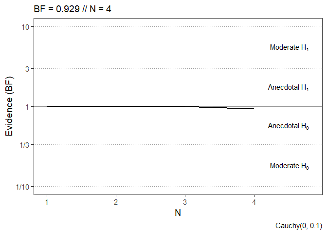
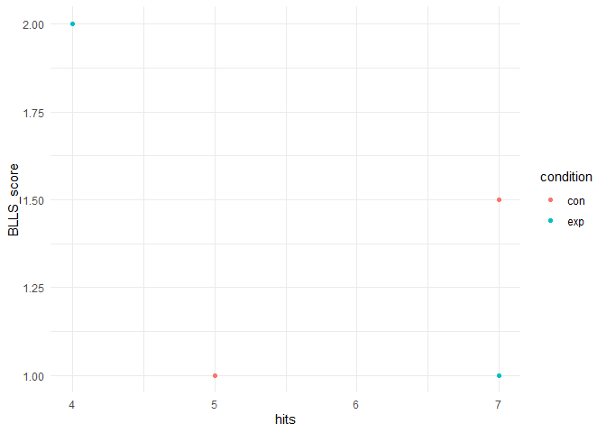

### Load Libraries


```r
library(qpsy)
library(tidyverse)
```

```
## ── Attaching core tidyverse packages ──────────────────────── tidyverse 2.0.0 ──
## ✔ dplyr     1.1.4     ✔ readr     2.1.5
## ✔ forcats   1.0.0     ✔ stringr   1.5.1
## ✔ ggplot2   3.5.1     ✔ tibble    3.2.1
## ✔ lubridate 1.9.3     ✔ tidyr     1.3.1
## ✔ purrr     1.0.2     
## ── Conflicts ────────────────────────────────────────── tidyverse_conflicts() ──
## ✖ dplyr::filter() masks stats::filter()
## ✖ dplyr::lag()    masks stats::lag()
## ℹ Use the conflicted package (<http://conflicted.r-lib.org/>) to force all conflicts to become errors
```

### Import Raw Data From Server

`loadexp()` directly downloads the raw data from the server.
The function has several arguments:

-   `study`: the directory of the study data (e.g. "testdata" or "testdata/study2")
-   `subdirs`: whether subdirectories should be included (e.g. multiple study parts "study1" and "study2" or files from different experimenters.)
-   `splitresponse`: whether responses to questionnaire trials should be stored as separate variables (e.g. "age", "gender", "questionnaire_item1", etc.)
-   `localcopy`: whether the data should be saved locally (e.g. "testdata.rds")

You will need to type in the password the first time you load data from the server.
Please contact [moritz.dechamps\@psy.lmu.de](mailto:moritz.dechamps@psy.lmu.de){.email} for the password.


```r
raw <- loadexp("testdata", subdirs = TRUE, splitresponse = TRUE, localcopy = TRUE)
```

```
## Splitting responses...
```

```
## 
 Found 18 records...
 Imported 18 records. Simplifying...
```

### Inspect Data

jsPsych outputs one line per trial.
In this example, the first line is language selection, the second is the consent form, the third is the welcome page, then a survey, and a couple of rng-trials.
You can use `print()` to view the first lines, `str()` to get an overview of the structure, i.e. all variables (columns) and their types, and `View()` to inspect the data in a new RStudio tab.


```r
print(raw)
```

```
## # A tibble: 102 × 26
##     file rt    stimulus             response trial_type trial_index time_elapsed
##    <int> <chr> <chr>                <chr>    <chr>            <int>        <int>
##  1     1 2704  "img/language-b.png" "0"      image-but…           0         2705
##  2     1 1630  ""                   ""       external-…           1         4341
##  3     1 777   ""                   ""       instructi…           2         5118
##  4     1 3108  ""                   "{\"BLL… survey               3         8238
##  5     1 null  "rng..."             "null"   html-keyb…           4         8290
##  6     1 null  "rng..."             "null"   html-keyb…           5         8460
##  7     1 null  "rng..."             "null"   html-keyb…           6         8569
##  8     1 null  "rng..."             "null"   html-keyb…           7         8679
##  9     1 null  "rng..."             "null"   html-keyb…           8         8786
## 10     1 null  "rng..."             "null"   html-keyb…           9         8893
## # ℹ 92 more rows
## # ℹ 19 more variables: internal_node_id <chr>, study <chr>, subject <chr>,
## #   time <dttm>, condition <chr>, url <chr>, view_history <chr>,
## #   test_part <chr>, accuracy <chr>, qbit <int>, BLLS_1 <int>, BLLS_2 <int>,
## #   BLLS_3 <int>, BLLS_4 <int>, age <int>, gender <chr>, bildung <chr>,
## #   handaufsherz <chr>, ungewoehnlich <chr>
```

```r
str(raw)
```

```
## tibble [102 × 26] (S3: tbl_df/tbl/data.frame)
##  $ file            : int [1:102] 1 1 1 1 1 1 1 1 1 1 ...
##  $ rt              : chr [1:102] "2704" "1630" "777" "3108" ...
##  $ stimulus        : chr [1:102] "img/language-b.png" "" "" "" ...
##  $ response        : chr [1:102] "0" "" "" "{\"BLLSIntro\":null,\"BLLS\":{\"BLLS_1\":0,\"BLLS_2\":1,\"BLLS_3\":2,\"BLLS_4\":3}}" ...
##  $ trial_type      : chr [1:102] "image-button-response" "external-html" "instructions" "survey" ...
##  $ trial_index     : int [1:102] 0 1 2 3 4 5 6 7 8 9 ...
##  $ time_elapsed    : int [1:102] 2705 4341 5118 8238 8290 8460 8569 8679 8786 8893 ...
##  $ internal_node_id: chr [1:102] "0.0-0.0" "0.0-1.0" "0.0-2.0" "0.0-3.0" ...
##  $ study           : chr [1:102] "testdata1" "testdata1" "testdata1" "testdata1" ...
##  $ subject         : chr [1:102] "sohh7gaopn0d6lm7" "sohh7gaopn0d6lm7" "sohh7gaopn0d6lm7" "sohh7gaopn0d6lm7" ...
##  $ time            : POSIXct[1:102], format: "2024-06-15 16:51:05" "2024-06-15 16:51:05" ...
##  $ condition       : chr [1:102] "exp" "exp" "exp" "exp" ...
##  $ url             : chr [1:102] "" "consent/consent_mm.html" "" "" ...
##  $ view_history    : chr [1:102] "" "" "[{\"page_index\":0,\"viewing_time\":777}]" "" ...
##  $ test_part       : chr [1:102] "" "" "welcome" "BLLS" ...
##  $ accuracy        : chr [1:102] "" "" "" "[]" ...
##  $ qbit            : int [1:102] NA NA NA NA 0 1 0 1 0 1 ...
##  $ BLLS_1          : int [1:102] 0 0 0 0 0 0 0 0 0 0 ...
##  $ BLLS_2          : int [1:102] 1 1 1 1 1 1 1 1 1 1 ...
##  $ BLLS_3          : int [1:102] 2 2 2 2 2 2 2 2 2 2 ...
##  $ BLLS_4          : int [1:102] 3 3 3 3 3 3 3 3 3 3 ...
##  $ age             : int [1:102] 35 35 35 35 35 35 35 35 35 35 ...
##  $ gender          : chr [1:102] "männlich" "männlich" "männlich" "männlich" ...
##  $ bildung         : chr [1:102] "Fach- oder Hochschulreife (Abitur)" "Fach- oder Hochschulreife (Abitur)" "Fach- oder Hochschulreife (Abitur)" "Fach- oder Hochschulreife (Abitur)" ...
##  $ handaufsherz    : chr [1:102] "Ja" "Ja" "Ja" "Ja" ...
##  $ ungewoehnlich   : chr [1:102] "Alles tip top!" "Alles tip top!" "Alles tip top!" "Alles tip top!" ...
```

```r
View(raw)
```

Interesting variables:

-   file: id of individual response file (not ordered temporally)
-   rt: reaction time in ms
-   stimulus: stimulus / text presented
-   response: response given by participant
-   study: study name and study part
-   subject: subject id
-   time: time of data collection (UTC+0)
-   more variables, e.g. condition, group, test_part, etc.

### Create Data Frame with 1 row per participant

Generally, we want to transform the raw data containing 1 row per trial into a data frame with 1 row per participant.
Additionally, we will perform some cleaning, recoding, and transformations.
Important functions:

-   `group_by()`: group data frame by a variable (this way 'hits' will be calculated per participant and not for all participants).
-   `mutate()`: add new variables to data frame.
-   `distinct()`: keep only unique rows.
-   `select()`: select variables.
-   `filter()`: filter rows to meet a condition.
-   `rowwise()`: calculate values per row (= participant). This is useful when calculating questionnaire scores. Turn off with `ungroup()`.
-   `summarise()`: aggregate data to summary statistics.


```r
df_all <- raw %>%                         # select raw data
  group_by(file) %>%                      # group by file = participations
  mutate(hits = sum(qbit, na.rm=T)) %>%   # sum up all qbits per file
  distinct(file, .keep_all=T) %>%         # keep only one row per file
  select(-c(rt:internal_node_id, url:qbit)) %>% 
                                          # drop unnecessary columns
  mutate(                                 # reverse score BLLS_3 and BLLS_4 (0 -> 4; 4 -> 0)
    BLLS_3 = -BLLS_3+4,
    BLLS_4 = -BLLS_4+4,
  ) %>%                                   
  mutate(                                 # if multiple languages, recode to English
    gender = case_when(
      gender %in% c("male", "männlich") ~ "male",
      gender %in% c("female", "weiblich") ~ "female",
      gender %in% c("divers", "other") ~ "other"
    )
  ) %>%
  rowwise() %>%                           # calculate scores per row / participant
  mutate(BLLS_score = mean(c(BLLS_1, BLLS_2, BLLS_3, BLLS_4))) %>% 
                                          # mean score of BLLS_1 to BLLS_4
  ungroup() %>%                           # ungroup data frame
  arrange(time)                           # sort by time of data collection

print(df_all)
```

```
## # A tibble: 6 × 16
##    file study  subject time                condition BLLS_1 BLLS_2 BLLS_3 BLLS_4
##   <int> <chr>  <chr>   <dttm>              <chr>      <int>  <int>  <dbl>  <dbl>
## 1     1 testd… sohh7g… 2024-06-15 16:51:05 exp            0      1      2      1
## 2     2 testd… u31kk1… 2024-06-15 16:51:36 exp            0      3      0      0
## 3     3 testd… qlekt1… 2024-06-15 16:51:59 exp            1      0      4      2
## 4     4 testd… rnlxf3… 2024-06-15 16:52:39 con            1      2      1      0
## 5     5 testd… 6vmltu… 2024-06-16 12:18:22 con            3      3      0      0
## 6     6 testd… pgbcm2… 2024-06-16 12:21:12 exp            0      4      1      3
## # ℹ 7 more variables: age <int>, gender <chr>, bildung <chr>,
## #   handaufsherz <chr>, ungewoehnlich <chr>, hits <int>, BLLS_score <dbl>
```

### Add More Variables to Data Frame

There might be information in some rows of the raw data that we want to add to our final data frame.
We can use `filter()` to select trials (=rows) with the relevant information and `mutate()` to add new variables to the existing ones or `summarise()` to create a data set of only new variables.
We can use `pivot_wider()` to transform multiple rows of 1 participant into 1 row with multiple columns. We can merge these new data frames with the existing data frame using `left_join()`.

In this example, we want to add the response and reaction time of the button press trial, and the individual qbits of each rng-trial.


```r
# We want to add the response of the button press trial and include the reaction times.
buttonChoice <- raw %>%
  filter(test_part=="buttonChoice") %>%   # filter for buttonChoice trials
  mutate(rt = as.numeric(rt)) %>%         # convert rt to numeric
  group_by(file) %>%                      # group by file = participations
  summarise(buttonChoice = response, rtChoice = mean(rt))        
                                          # print response and calculate mean reaction time per file (mean not actually necessary in case of 1 observation)

print(buttonChoice)
```

```
## # A tibble: 6 × 3
##    file buttonChoice rtChoice
##   <int> <chr>           <dbl>
## 1     1 0                1003
## 2     2 1                1679
## 3     3 1                1351
## 4     4 1                1251
## 5     5 1                 965
## 6     6 0                 999
```

```r
# We want to have the qbits of each trial as separate variables
qbits <- raw %>%
  filter(test_part=="rngTrial") %>%       # filter for qbit trials
  select(file, qbit) %>%                  # select variables "file" and "qbit"
  mutate(trial = rep(1:10, length(unique(file)))) %>% 
                                          # create variable "trial" with values 1 to 10 to distinguish between trials
  pivot_wider(id_cols = file, values_from = qbit, names_from = trial, names_prefix = "qbit") 
                                          # create separate variables for each qbit

print(qbits)
```

```
## # A tibble: 6 × 11
##    file qbit1 qbit2 qbit3 qbit4 qbit5 qbit6 qbit7 qbit8 qbit9 qbit10
##   <int> <int> <int> <int> <int> <int> <int> <int> <int> <int>  <int>
## 1     1     0     1     0     1     0     1     1     1     1      1
## 2     2     1     0     0     0     1     1     0     0     0      1
## 3     3     1     0     1     0     1     1     1     1     1      0
## 4     4     1     1     1     0     0     1     0     0     1      0
## 5     5     1     1     1     1     1     0     1     0     0      1
## 6     6     0     0     1     1     0     1     0     1     0      0
```

```r
# Merge the new variables to the data frame
df_all <- df_all %>%
  left_join(buttonChoice, by="file") %>%  # join buttonChoice to df_all
  left_join(qbits, by="file")             # join qbits to df_all

print(df_all)
```

```
## # A tibble: 6 × 28
##    file study  subject time                condition BLLS_1 BLLS_2 BLLS_3 BLLS_4
##   <int> <chr>  <chr>   <dttm>              <chr>      <int>  <int>  <dbl>  <dbl>
## 1     1 testd… sohh7g… 2024-06-15 16:51:05 exp            0      1      2      1
## 2     2 testd… u31kk1… 2024-06-15 16:51:36 exp            0      3      0      0
## 3     3 testd… qlekt1… 2024-06-15 16:51:59 exp            1      0      4      2
## 4     4 testd… rnlxf3… 2024-06-15 16:52:39 con            1      2      1      0
## 5     5 testd… 6vmltu… 2024-06-16 12:18:22 con            3      3      0      0
## 6     6 testd… pgbcm2… 2024-06-16 12:21:12 exp            0      4      1      3
## # ℹ 19 more variables: age <int>, gender <chr>, bildung <chr>,
## #   handaufsherz <chr>, ungewoehnlich <chr>, hits <int>, BLLS_score <dbl>,
## #   buttonChoice <chr>, rtChoice <dbl>, qbit1 <int>, qbit2 <int>, qbit3 <int>,
## #   qbit4 <int>, qbit5 <int>, qbit6 <int>, qbit7 <int>, qbit8 <int>,
## #   qbit9 <int>, qbit10 <int>
```

### Exclude Participants

We have successfully created a data frame with 1 row per participant.
Now we want to exclude participants who should not be included in the analysis.
This could be duplicate participations, underage participants, or participants who failed the data integrity question.

We can use `filter()` to exclude participants based on a condition and `distinct()` to keep only unique participations of one participant.


```r
# Check if there are duplicate subject ids
anyDuplicated(df_all$subject)
```

```
## [1] 0
```

```r
# Create final data frame
df <- df_all %>%
  distinct(subject, .keep_all = TRUE) %>%  # keep only the first participation if a subject id is duplicated
  filter(handaufsherz %in% c("Ja", "Yes")) %>% 
                                           # filter for participants who answered the data integrity question correctly
  filter(age >= 18)                        # use only participants over 18
```

### Save Data Frame as CSV

We can save the data as .csv-file, e.g. to analyze it with JASP.


```r
write_csv2(df, "testdata.csv")
```

### Describe Final Data

Now we can analyze the data.
First, we should check the descriptive statistics.
We can use `describe()` from the `psych` package for descriptive statistics and `table()` for frequencies.


```r
library(psych)
```

```
## 
## Attache Paket: 'psych'
```

```
## Die folgenden Objekte sind maskiert von 'package:ggplot2':
## 
##     %+%, alpha
```

```r
df %>%
  select(age, hits, BLLS_score) %>% # select which variables to describe
  describe()                        # use describe() for descriptive statistics
```

```
##            vars n  mean    sd median trimmed  mad min max range  skew kurtosis
## age           1 4 34.00 14.45  30.00   34.00 9.64  22  54    32  0.46    -1.92
## hits          2 4  5.75  1.50   6.00    5.75 1.48   4   7     3 -0.14    -2.28
## BLLS_score    3 4  1.38  0.48   1.25    1.38 0.37   1   2     1  0.32    -2.08
##              se
## age        7.22
## hits       0.75
## BLLS_score 0.24
```

```r
# describe by group (condition)
describeBy(hits + BLLS_score ~ condition, data=df)
```

```
## 
##  Descriptive statistics by group 
## condition: con
##            vars n mean   sd median trimmed  mad min max range skew kurtosis
## hits          1 2 6.00 1.41   6.00    6.00 1.48   5 7.0   2.0    0    -2.75
## BLLS_score    2 2 1.25 0.35   1.25    1.25 0.37   1 1.5   0.5    0    -2.75
##              se
## hits       1.00
## BLLS_score 0.25
## ------------------------------------------------------------ 
## condition: exp
##            vars n mean   sd median trimmed  mad min max range skew kurtosis  se
## hits          1 2  5.5 2.12    5.5     5.5 2.22   4   7     3    0    -2.75 1.5
## BLLS_score    2 2  1.5 0.71    1.5     1.5 0.74   1   2     1    0    -2.75 0.5
```

```r
table(df$gender)                    # use table() for frequencies
```

```
## 
## female   male 
##      2      2
```

```r
table(df$bildung)                   # use table() for frequencies
```

```
## 
## Fach- oder Hochschulreife (Abitur)                     Mittlere Reife 
##                                  2                                  1 
##                  University degree 
##                                  1
```

### Analyze and Visualize Data

Finally, we can do our analyses.
E.g., we might want to check for group differences with a t-test or ANOVA, or we might want to visualize the data with `ggplot()`.

For more information on Bayesian testing using the `changeofevidence` package, see [changeofevidence t-test Vignette](https://mrzdcmps.github.io/changeofevidence/vignette-t-test.html).


```r
# t-test for group differences in hits
t.test(hits ~ condition, data=df, var.equal=T)
```

```
## 
## 	Two Sample t-test
## 
## data:  hits by condition
## t = 0.27735, df = 2, p-value = 0.8075
## alternative hypothesis: true difference in means between group con and group exp is not equal to 0
## 95 percent confidence interval:
##  -7.256718  8.256718
## sample estimates:
## mean in group con mean in group exp 
##               6.0               5.5
```

```r
# Bayesian t-test for group differences in hits
library(changeofevidence)
bf <- bfttest(hits ~ condition, data=df)
```

```
## Warning in bfttest(hits ~ condition, data = df): No alternative specified.
## Using a two-sided alternative.
```

```
## Independent Samples test (N = 4 [2 + 2])
## Calculating Sequential Bayes Factors...
## 
  |                                                                            
  |                                                                      |   0%
  |                                                                            
  |======================================================================| 100%
## Final Bayes Factor: 0.928946 (t=0.2773501; p=0.8075499)
```

```r
plot(bf)
```

<!-- -->

```r
# ANOVA for gender differences in BLLS_score
anova <- aov(df$BLLS_score ~ df$gender)
summary(anova)
```

```
##             Df Sum Sq Mean Sq F value Pr(>F)
## df$gender    1 0.0625  0.0625     0.2  0.698
## Residuals    2 0.6250  0.3125
```

```r
# Plot scatterplot of hits and BLLS_score
ggplot(df, aes(x=hits, y=BLLS_score, color=condition)) +
  geom_point() +
  theme_minimal()
```

<!-- -->
